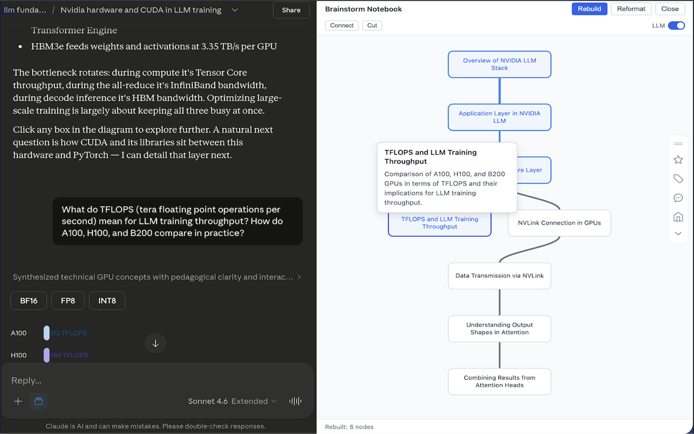

# Brainstorm Notebook

A Chrome extension that generates interactive mind-map graphs from your AI conversations on **Claude**, **ChatGPT**, and **Gemini**. Each conversation turn becomes a node, with edges showing how topics flow and connect across the discussion.

## Example



## Features

- **Auto-generated mind-maps** — Conversation turns are analyzed by an LLM and turned into a graph of connected topics
- **Real-time updates** — New nodes appear automatically as you chat
- **Batch rebuild** — Analyze an entire conversation at once for accurate cross-topic connections
- **Multi-provider API support** — Works with Anthropic (Claude), OpenAI, and Google Gemini keys, auto-detected by prefix
- **Multi-platform support** — Works on claude.ai, chatgpt.com, and gemini.google.com
- **Interactive canvas** — Pan, zoom, drag nodes, click to highlight ancestor chains
- **Manual edge editing** — Connect or cut edges between nodes to refine the graph
- **Hover tooltips** — See full title and summary for each node
- **Encrypted key storage** — API keys encrypted at rest with AES-256-GCM via a user-set passphrase
- **Per-conversation persistence** — Graphs and node positions saved locally
- **Cache management** — View cache size and clear graphs by age (24h, 3 days, 1 month, or all)

## How It Works

1. Open a conversation on [claude.ai](https://claude.ai), [chatgpt.com](https://chatgpt.com), or [gemini.google.com](https://gemini.google.com)
2. Click the extension icon or the floating button to open the panel
3. Click **Rebuild** to analyze the full conversation, or let it auto-detect new responses
4. The LLM reads each turn and decides:
   - A short title and one-sentence summary
   - Which earlier turns it connects to (strong, middle, or thin)
   - Whether it's a new topic (no parents → new root node)
5. The graph renders nodes by level, with Bezier curve edges showing relationships

For conversations under 20 turns, all turns are sent in a single batch. Longer conversations are chunked into groups of 20, then a merge pass finds cross-chunk connections.

## Setup

### Prerequisites

- Node.js 18+
- npm
- A Chrome-based browser

### Install

```bash
git clone <repo-url>
cd brainstorm-notebook
npm install
npm run build
```

### Load in Chrome

1. Go to `chrome://extensions/`
2. Enable **Developer mode** (top-right)
3. Click **Load unpacked** → select the `dist/` folder

### Configure

1. Right-click the extension icon → **Options**
2. Set a passphrase (used to encrypt your API keys locally)
3. Add one or more API keys:
   - `sk-ant-...` → Anthropic (Claude Haiku 4.5)
   - `sk-...` → OpenAI (GPT-4o Mini)
   - `AIza...` → Google Gemini 2.0 Flash
4. Keys are tried in order — if one fails, the next is used

## Usage

| Action | How |
|---|---|
| Open/close panel | Click extension icon or floating button |
| Rebuild graph | Click **Rebuild** in the panel header |
| Pan canvas | Drag on empty space |
| Zoom | Scroll wheel |
| Move a node | Drag it |
| Select a node | Click it (highlights ancestor chain, scrolls chat to that message) |
| Deselect | Click the same node again, or click empty space |
| Connect nodes | Click **Connect**, then click two nodes to add an edge |
| Cut edge | Click **Cut**, then click an edge to remove it |
| Hover tooltip | Hover over any node |
| Resize panel | Drag the left edge |

## Project Structure

```
src/
├── background/
│   └── service-worker.ts        # API key decryption, API call routing
├── content/
│   ├── index.ts                 # Entry point, message listener
│   ├── panel.ts                 # Panel UI, graph interaction, rebuild logic
│   ├── observer.ts              # DOM polling, conversation turn extraction
│   ├── graph-canvas.ts          # Canvas rendering, hit testing, pan/zoom
│   ├── graph-layout.ts          # Hierarchical level-based layout
│   ├── graph-interaction.ts     # Ancestor path traversal
│   ├── platforms.ts             # Platform configs (Claude, ChatGPT, Gemini)
│   └── panel.css                # Panel styles (injected into shadow DOM)
├── options/
│   ├── index.html               # Options page entry
│   ├── options.tsx               # Settings UI (Preact)
│   ├── key-manager.tsx           # Drag-to-reorder key list
│   └── options.css               # Options page styles
└── shared/
    ├── types.ts                  # GraphNode, GraphEdge, ApiKeyEntry, etc.
    ├── messages.ts               # Extension message types
    ├── storage.ts                # Chrome storage wrappers
    ├── crypto.ts                 # PBKDF2 + AES-256-GCM encryption
    ├── claude-api.ts             # Multi-provider API client with fallback
    └── prompts.ts                # LLM prompt templates (single, batch, merge)
```

## Tech Stack

- **TypeScript** + **Preact** for the options UI
- **Vite** with three build targets (content script, service worker, options page)
- **Canvas API** for graph rendering
- **Web Crypto API** for key encryption (PBKDF2 key derivation, AES-256-GCM)
- **Chrome Extension Manifest V3**

## Build Scripts

| Script | Description |
|---|---|
| `npm run build` | Full build (clean + all targets + copy assets) |
| `npm run build:content` | Build content script only |
| `npm run build:sw` | Build service worker only |
| `npm run build:options` | Build options page only |
| `npm run build:clean` | Remove and recreate `dist/` |
| `npm run release` | Full build + package into versioned zip for Chrome Web Store |

## Graph Edge Types

| Strength | Meaning | Visual |
|---|---|---|
| **Strong** | Direct continuation of previous turn | 3px line |
| **Middle** | Same topic, related discussion | 2px line |
| **Thin** | Loosely related concept | 1px line |

Nodes with no connections to prior turns become root nodes at the top level of the graph.
